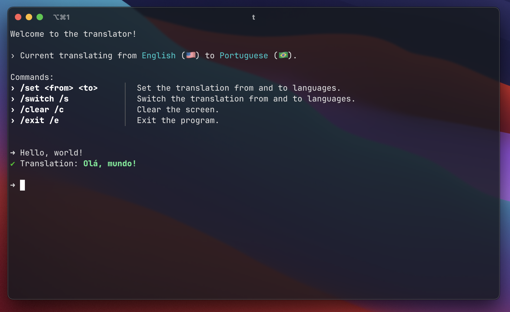

# translate-cli

A command-line interface to translate any text.

## Installing

```sh
$ bun i
$ bun run compile
$ mv ./dist/t ~/bin # ~/bin or any directory in your $PATH

# Reload your terminal
```

## Usage

This CLI uses a interactive terminal, you can type any phrases in a single session.

Use the `/switch` command to change the languages.

```sh
$ t
```



## Development

```sh
$ bun i
$ bun run start
```
